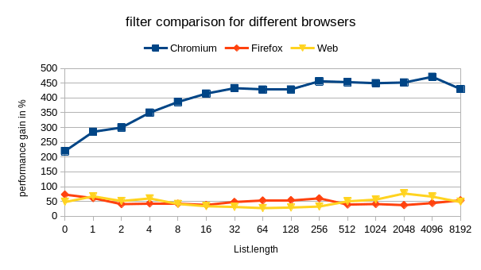
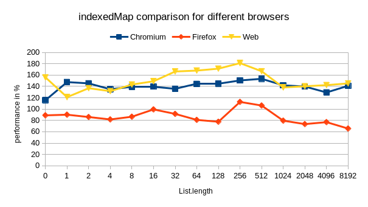
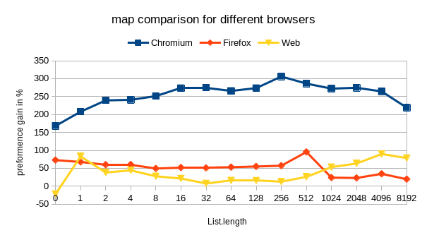
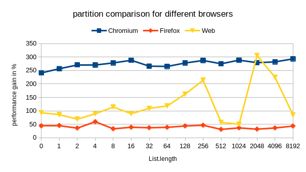
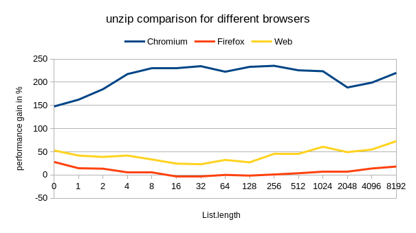

# elm-blist

Just for comparison purposes. This project provides some reimplemenations for:

* `List.filter`
* `List.indexedMap`
* `List.map`
* `List.partition`
* `List.unzip`

all of them have been use the same basic tail-recursive structure with `case of`
and then a `List.reverse` for the output.

``` elm
do : (a -> b) -> List a -> List b
do fn input =
  helper fn input []

doHelper : (a -> b) -> List a -> List b -> List b
doHelper fn input output =
    case input of
        [] ->
            List.reverse output

        x :: xs ->
            mapHelper f xs (f x :: output)
```

It seems, at least on my computer, that these alternatives result in an
performance increase. You can repeat the experiments, if you:

```
cd benchmark

elm reactor

# execute the experiments in src
```

## Measurements

I run the benchmark on three different browsers:

1. **Chromium:** Version 83.0.4103.116 (Developer Build) built on Debian bullseye/sid, running on Debian bullseye/sid (64-bit)
2. **Firefox:** 89.0 (64-Bit)
3. **Web:** 40.0 (as a Safari alternative)

Measurements were performed for quadratically growing list-sizes: 0, 1, 2, 4, 8, 16, 32, 64, 128, 256, 512, 1024, 2048, 4096, 8192

all measurements can be found in the locally attached measurements.ods











